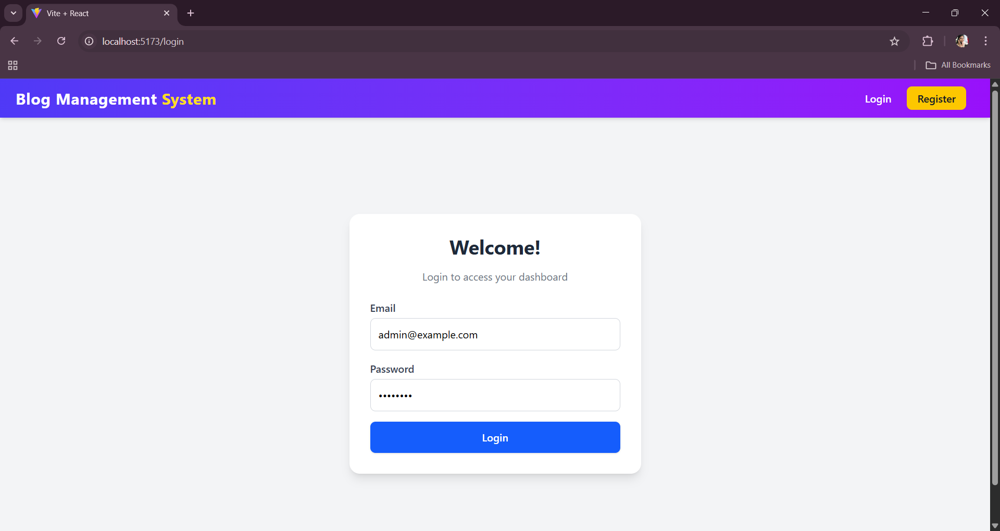

# Blog Management System

A **full-stack web application** designed for blog management.  
This system enables **administrators** to create, update, delete, and list blog posts, while **users** can view blogs and mark them as read.

---

## 📌 Features

### 👩‍💻 Admin Features
- **Login** with admin credentials  
- **Manage Blogs**: Create, update, and delete blog posts  
- **View All Blogs**: List all blogs  
- **Fields**: Title, Content, Image, Created Date (auto-taken as current date)  

### 👤 User Features
- **Login** with user credentials  
- **Blog Cards**: View unseen blogs (disappear once viewed)  
- **View Blogs**: Read individual blog posts  
- **Unread Count**: Track the number of unread blogs  

---

## 🛠 Technologies Used

**Frontend**
- React.js (Vite)  
- React Router DOM  
- Axios  

**Backend**
- Node.js  
- Express.js  
- Sequelize ORM  
- MySQL  

**Authentication**
- JWT (JSON Web Tokens)  

**File Upload**
- Multer (for handling image uploads)  

**Styling**
- Tailwind CSS  

---

## 🧱 Architecture

The application follows the **MVC (Model-View-Controller)** architecture:

- **Model**: Sequelize models for `Blog` and `BlogView`  
- **View**: React components for the user interface  
- **Controller**: Express.js controllers for handling API requests  

---

## 🚀 Getting Started

### Prerequisites
- Node.js  
- MySQL  

---

### 🔧 Installation

1. Clone the repository:

```bash
git clone https://github.com/Athira-351/blog_management_system.git
cd blog_management_system
````

---

2. Set up the backend:

```bash
cd backend
npm install
```

* Setup Database

Start the backend:

```bash
npx nodemon server.js
```

---

3. Set up the frontend:

```bash
cd frontend
npm install
```

Start the frontend:

```bash
npm run dev
```

The frontend will be running at [http://localhost:5173](http://localhost:5173)
The backend will be running at [http://localhost:5000](http://localhost:5000)

---
<div style="display: flex; gap: 10px;">
  
  
</div>
<div style="display: flex; gap: 10px;">
  
  
</div>
<div style="display: flex; gap: 10px;">
  
  
</div>
<div style="display: flex; gap: 10px;">
  
  
</div>
<div style="display: flex; gap: 10px;">
  
</div>

---
# Demo video
<a href="https://drive.google.com/uc?export=download&id=1Gs66nq2FRCzAVq5saNhKs6U465WZIffT">
  
</a>

---


